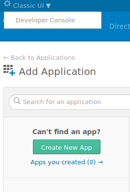
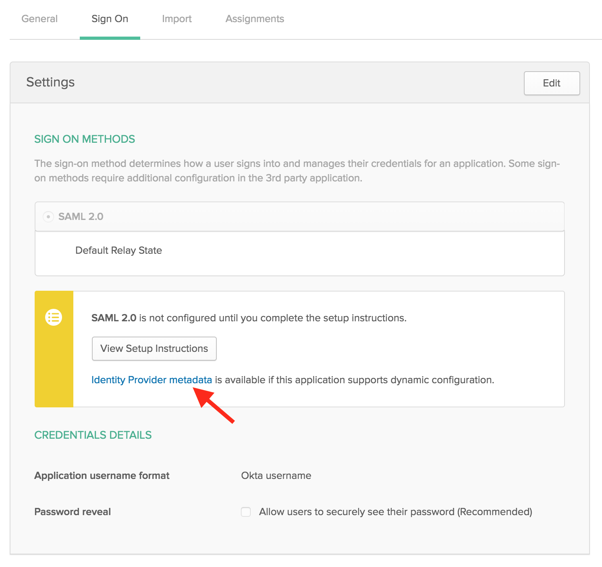

# flask-pysaml2-okta

This guide is a step by step process for creating a Flask SAML integration and is an amalgamation of two articles and the python3 sample flask app


> Looking for a Django Implementation? [Look Here](https://github.com/jonwhittlestone/okta-django-saml2)

Okta Guide for Configuring PySAML2:

    https://developer.okta.com/code/python/pysaml2/

Okta guide for creating a SAML Application:

    https://developer.okta.com/standards/SAML/setting_up_a_saml_application_in_okta/

## Prerequisite

- Git
- Sign up for an Okta developer account
- Okta Classic UI
  When logged in, choose 'Classic UI' from view dropdown at top-left of the page (screenshot below)
- Follow [Okta's guite](https://developer.okta.com/standards/SAML/setting_up_a_saml_application_in_okta/) for setting up a SAML App.

  > _Configure the SAML Identity Provider with the details of your application (the new SAML service provider)_

## Steps

1. Choose 'Classic UI' for viewing Okta's developer portal

   

2. Create App to get the modal 'Create a New Application Integration'

   - Platform: _Web_
   - Sign on method: _SAML 2.0_
   - click button CREATE

   Create SAML Integration Page

   - Step 2: Configure SAML

     - Single sign on URL: _http://localhost:5000/saml/sso/example-okta-com_
     - As per the guide, create attribute statements
       1. "FirstName" set to "user.firstName"
       2. "LastName" set to "user.lastName"
       3. "Email" set to "user.email"

   - Add feedback
   - click FINISH. The app is now created
   - Under settings, view the Identity Provider metadata and keep open for later
   - Click 'People' and assign to the dev user

3. In the flask app, modify the line with the URL of your Identity Provider Metadata (see screenshot below)

   

   ```
       metadata_url_for = {
           'example-okta-com': '${metadata_url}'
       }
   ```

4. Build the docker container and tag, and run

   ```
   $ docker build . -t python3-okta-example`

   $ docker run -p 5000:5000 python3-okta-example
   ```

5. In a browser, visit [localhost:5000](http://localhost:5000), and select relevant Okta application

6. Succesful log in via SAML to the Service Provider can be verified on the Okta dashboard (non-Classic UI)
